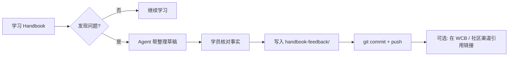

# Handbook Feedback 流程

把学习中的问题沉淀为**可公开、可索引、可复盘**的材料，供 Handbook 共建。

## 何时写 feedback

- 概念不清楚或前后矛盾
- 错别字、链接失效、资料过期
- 章节结构建议
- 希望增加案例、图解、最小实践
- Agent 或课程说明与 Handbook 不一致

## 文件命名

```text
handbook-feedback/YYYY-MM-DD-简短主题.md
```

示例：`2026-05-17-agent-wallet-session-key.md`

## 单条 feedback 模板

复制 [`TEMPLATE.md`](TEMPLATE.md) 新建文件。

## 工作流



## Agent 职责

1. 从 `daily/` 的「不懂问题」提取可提交的 feedback 草稿。
2. 每条必须包含 **Handbook 页面 URL**（不猜测未读章节内容）。
3. 不自动 push；学员确认后执行 git 流程。

## 隐私

- 不写真实 API Key、钱包助记词、他人隐私。
- 若问题涉及内部链接，用「已私信助教」代替具体 URL。

## 与课程的关系

Feedback 是**建议与问题记录**，不替代 WCB 正式作业提交。作业 PoW 仍放在 `submissions/` 与 `daily/` 打卡回执中。
